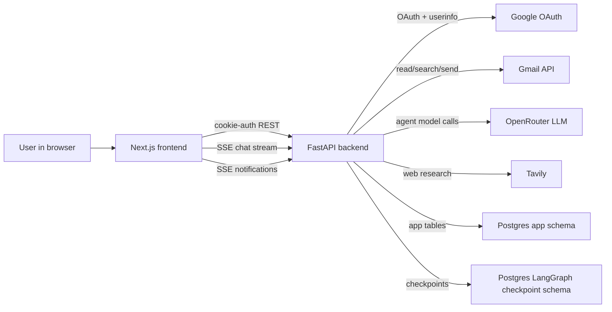
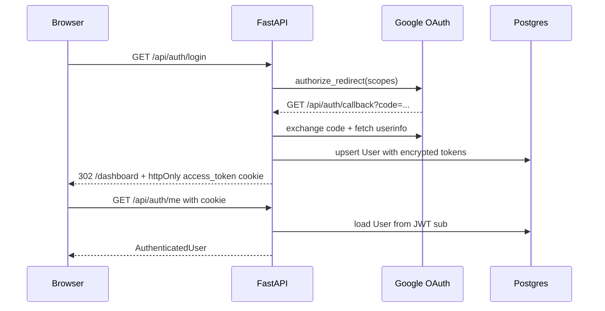
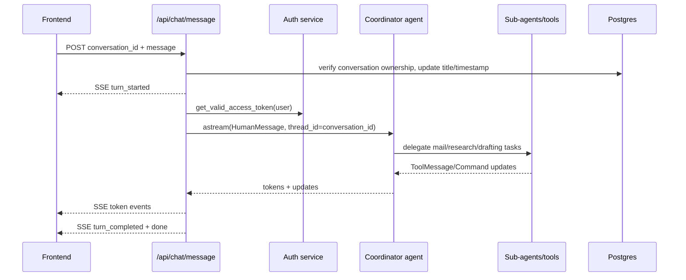
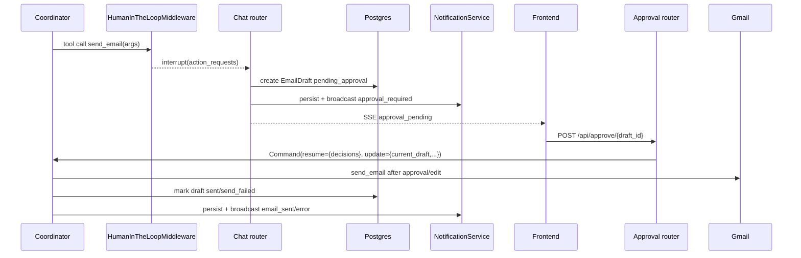

# Backend Architecture

## Document Status

- **Scope:** FastAPI backend in `backend/app/`, including auth, Gmail integration, LangGraph orchestration, HITL approval, SSE, and persistence.
- **Audience:** backend contributors, frontend integrators, reviewers, operators, and coding agents.
- **Last reviewed:** 2026-06-21.

Update this file when a backend boundary, persistence model, cross-cutting convention, agent workflow, deployment assumption, or frontend-facing contract changes.

## Executive Summary

The backend is the trusted service boundary for the Autonomous Email Agent. It authenticates users through Google OAuth, stores Gmail tokens encrypted at rest, reads and sends Gmail messages, orchestrates LangChain/LangGraph agents, persists conversation and approval state, and streams live progress to the Next.js client.

The most important architectural invariant is that the final Gmail send is gated by human approval. The coordinator agent may research, read email, and draft content, but the `send_email` tool is wrapped in LangGraph human-in-the-loop middleware. A draft is persisted before approval, and the Gmail send only happens after the same LangGraph thread resumes with an approval or edit decision.

## Goals and Non-Goals

### Goals

- Keep privileged operations server-side: OAuth, token refresh, Gmail API calls, LLM orchestration, persistence, and final send.
- Maintain cookie-based authentication using an httpOnly backend-issued JWT cookie.
- Support resumable LangGraph conversations and approval workflows through Postgres checkpointing.
- Provide structured conversation history that the frontend can render as reports, email cards, research notes, and draft artifacts.
- Keep the agent workflow observable to the UI through SSE without exposing secrets or Gmail tokens.

### Non-Goals

- The backend does not serve the frontend UI.
- The backend does not expose Gmail or OpenRouter credentials to the browser.
- The backend does not use bearer-token auth from the frontend.
- The backend does not rely on Next.js route handlers, server actions, or Firebase.
- The current repository does not include a production deployment definition or Docker setup.

## System Context



The backend is the only component that talks directly to Google OAuth, Gmail, OpenRouter, Tavily, and Postgres. The frontend calls `/api/*` with cookies and renders structured results.

## Architectural Drivers

| Driver | Architectural response |
| --- | --- |
| Gmail tokens are sensitive | Tokens are encrypted with Fernet before storage and are never sent to the frontend. |
| Sending email is non-idempotent | `send_email` is the HITL boundary and executes only after LangGraph resume. |
| Chat workflows are multi-step and resumable | Coordinator state and messages are checkpointed with LangGraph Postgres persistence. |
| Users need live progress | `/api/chat/message` streams request-scoped SSE events; `/api/notifications/stream` streams long-lived approval/send notifications. |
| Frontend needs rich structured rendering | Backend converts LangGraph messages and draft rows into typed content blocks. |
| Local development should be low-friction | Startup calls `Base.metadata.create_all`; Alembic remains the schema source of truth. |

## Solution Strategy

The backend uses a layered FastAPI structure:

- **Routers** define authenticated HTTP/SSE boundaries.
- **Services** own external integrations and cross-cutting domain behavior.
- **Agents** own LLM orchestration and tool delegation.
- **Models and migrations** own the app database schema.
- **LangGraph checkpointer** owns resumable agent state in the same Postgres database.

The application uses one database for two persistence systems:

1. **App tables** managed by Alembic and SQLAlchemy: `users`, `conversations`, `email_drafts`, `notifications`.
2. **LangGraph checkpoint tables** managed by `AsyncPostgresSaver.setup()` during FastAPI lifespan startup.

## Major Components

| Component | Responsibility | Key files |
| --- | --- | --- |
| FastAPI app | Lifespan startup, middleware, router registration, uniform error handlers, health check. | `app/main.py` |
| Auth boundary | Google OAuth, JWT cookie creation, current-user dependency, token refresh. | `routers/auth.py`, `middleware/auth_middleware.py`, `services/auth_service.py` |
| Gmail integration | Gmail API client, message/thread reads, send operation, query construction. | `services/gmail_service.py`, `utils/email_parser.py` |
| Chat API | Conversation CRUD, chat SSE, history reconstruction, coordinator invocation. | `routers/chat.py` |
| Agent system | Coordinator, sub-agents, prompts, tools, HITL middleware, state schema. | `agents/` |
| Approval API | Pending draft list, approve/edit/reject, LangGraph resume. | `routers/approve.py` |
| HITL persistence | Detect send interrupts, persist drafts, emit approval events. | `services/hitl_service.py` |
| Notifications | Persisted notifications plus per-process SSE queues. | `routers/notifications.py`, `services/notification_service.py` |
| App persistence | Async SQLAlchemy engine/session and Alembic schema. | `database.py`, `models/`, `alembic/` |
| LangGraph persistence | Async Postgres checkpointer and connection pool. | `checkpointer.py` |

## Runtime Views

### Authentication



The cookie is named `access_token`. The frontend may check cookie presence for routing, but the backend is the authority that validates the JWT and user.

### Chat and Agent Streaming



The coordinator thread is conversation-scoped. Sub-agent threads are user-scoped so the mail reader, web search, and mailing agents can retain user-level context without sharing the coordinator conversation checkpoint.

### HITL Approval and Resume



Rejecting a draft marks it `rejected`, broadcasts `email_rejected`, and resumes the same LangGraph thread with feedback. The coordinator reads the feedback from the rejection `ToolMessage` and `state.draft_feedback` and decides whether to re-run web search based on the static `COORDINATOR_SYSTEM_PROMPT` rule (no precomputed flag).

### History Reconstruction

Conversation history is not stored as a plain chat table. `GET /api/chat/history/{conversation_id}` reads:

- LangGraph checkpoint messages for the conversation `thread_id`.
- `EmailDraft` rows for the conversation.

`routers/chat.py` then serializes those into frontend content blocks:

- `markdown`
- `status`
- `tool_action`
- `email_list`
- `summary`
- `research_report`
- `draft_email`
- `system_notice`

This makes the backend the source of truth for the semantic shape of assistant turns.

## Data Architecture

### App Tables

| Table | Purpose |
| --- | --- |
| `users` | Google identity, encrypted access/refresh tokens, token expiry, Gmail scope flag. |
| `conversations` | User-owned conversation records; IDs also serve as coordinator LangGraph thread IDs. |
| `email_drafts` | Approval-gated draft state, edited fields, Gmail sent ID, reply metadata. |
| `notifications` | Persisted approval/send/error notification records with JSON metadata. |

### Relationships and Ownership

- `users` owns conversations, drafts, and notifications with cascade delete.
- `email_drafts.conversation_id` is nullable and uses `SET NULL` if a conversation is deleted.
- Draft status is constrained to `pending_approval`, `approved`, `rejected`, `sent`, or `send_failed`.
- Draft type is constrained to `reply` or `fresh`.

### Sensitive Data

- Google access and refresh tokens are encrypted in `users`.
- Gmail message content can flow through agent prompts, LangGraph checkpoints, and frontend-rendered blocks.
- Notification metadata can contain draft payloads; treat it as sensitive application data.

## API and Integration Boundaries

### Frontend-Facing API Groups

| Prefix | Responsibility |
| --- | --- |
| `/api/auth` | OAuth login/callback/logout/current user. |
| `/api/chat` | Conversation list/create/history and request-scoped assistant SSE stream. |
| `/api/emails` | Direct Gmail read/search/detail endpoints. |
| `/api/approve` | Pending approvals and HITL resume. |
| `/api/notifications` | Long-lived notification SSE stream plus notification list/read APIs. |

### External Integrations

- **Google OAuth:** identity and Gmail consent.
- **Gmail API:** read/search/thread/send via `google-api-python-client`.
- **OpenRouter:** LLM provider through `langchain-openrouter`.
- **Tavily:** web research tool.
- **Postgres:** app schema and LangGraph checkpoint schema.

## Deployment View

The code assumes a single FastAPI process with:

- Python 3.11+.
- `python -m app.dev_server` for local development. This wrapper starts `uvicorn` with `app.uvicorn_loop:selector_loop_factory`, which avoids the Windows `ProactorEventLoop` incompatibility in psycopg async pools.
- Postgres reachable through two DSNs:
  - `DATABASE_URL` for async SQLAlchemy/asyncpg.
  - `DATABASE_URL_PSYCOPG` for Alembic and LangGraph/psycopg.
- Environment variables defined in [`environment.md`](environment.md).
- A separate Next.js frontend origin configured as `FRONTEND_URL`.

The live notification broadcaster is in-memory and per-process. If the backend is horizontally scaled, `/api/notifications/stream` needs a shared pub/sub layer or sticky sessions to preserve live notification delivery across workers.

## Security and Trust Model

- Browser authentication uses an httpOnly JWT cookie issued by the backend.
- OAuth uses Google scopes: `openid`, `email`, `profile`, `gmail.readonly`, and `gmail.send`.
- Gmail tokens are encrypted with Fernet before storage.
- The frontend never receives Gmail tokens and never sends bearer tokens.
- Every protected router uses `get_current_user`.
- Conversation, draft, and notification access is scoped by the authenticated user.
- CORS allows only `settings.FRONTEND_URL` with credentials.
- The final Gmail send is the critical non-idempotent side effect and is approval-gated.

## Cross-Cutting Concepts

### Error Handling

`app/main.py` returns a consistent error envelope:

```json
{ "error": "<ExceptionClassName>", "detail": "..." }
```

Validation errors return `422` with `detail: exc.errors()`. Unknown exceptions are logged and returned as `500` with `detail: "Internal server error"`.

### Configuration

`Settings` in `app/config.py` uses `pydantic-settings`, `.env`, defaults for importability, and a cached module-level `settings` instance.

### Database Sessions

Routers receive an `AsyncSession` through `Depends(get_db)`. The code generally commits at service/router boundaries after mutating app tables.

### Agent Context

`AgentContext` carries user ID, conversation ID, Gmail service, DB session, and notification service into all LangChain tools and agents.

### SSE Framing

SSE responses use `text/event-stream`, `Cache-Control: no-cache`, `X-Accel-Buffering: no`, and `data: {json}\n\n`.

## Architectural Decisions

| Decision | Status | Rationale / impact |
| --- | --- | --- |
| Backend owns all privileged operations | Accepted | Keeps tokens, Gmail sends, persistence, and LLM orchestration out of the browser. |
| Auth is cookie-based | Accepted | Enables browser credential handling with httpOnly cookies and avoids client-side bearer tokens. |
| LangGraph coordinator thread equals conversation ID | Accepted | Makes conversation history, checkpointing, and approval resume share one stable identifier. |
| Sub-agent threads are user-scoped | Accepted | Allows specialized agents to retain user-level context independent of individual conversations. |
| `send_email` is the HITL boundary | Accepted | Prevents non-idempotent email sends before approval. |
| Same Postgres DB backs app data and LangGraph checkpoints | Accepted | Simplifies deployment and keeps conversation state near app data, with two persistence owners. |
| Notifications are persisted and broadcast live | Accepted with caveat | Gives both history and real-time UX, but in-memory live queues are single-process only. |

Create ADRs under `docs/adr/` if these decisions change or if a new cross-cutting decision is introduced.

## Quality Attribute Scenarios

| Attribute | Scenario | Mechanism |
| --- | --- | --- |
| Security | A browser request attempts to access another user's conversation or draft. | JWT user is loaded server-side and ownership checks reject mismatched resources. |
| Safety | An agent decides to send an email. | LangGraph HITL middleware interrupts before `send_email`; draft is persisted for review. |
| Recoverability | The user approves or rejects after the original chat request ended. | LangGraph checkpoint plus `Command(resume=...)` resumes the same conversation thread. |
| Usability | The user needs progress during long agent runs. | Chat SSE streams tokens and approval-pending events. |
| Maintainability | Frontend rendering should not parse raw tool text. | Backend emits structured `content_blocks` from checkpoint messages and draft rows. |
| Operability | Browser tab waits on approval/send events. | Notification SSE uses keepalive pings and persisted notifications. |

## Risks and Technical Debt

| Risk / debt | Impact | Mitigation |
| --- | --- | --- |
| Notification broadcasts are in-memory | Live notifications can be lost across multiple backend workers or process restarts. | Use Redis/Postgres pub-sub or another shared event bus before horizontal scaling. |
| `Base.metadata.create_all` runs on startup | Convenient locally but can mask migration discipline. | Keep Alembic as production source of truth; remove or gate bootstrap for production if needed. |
| Agent tests are stale | `test_agent_factories.py` and `test_agent_tools.py` reference removed symbols. | Update/delete stale tests before relying on full backend test status. |
| No router/integration tests | Auth, SSE, HITL resume, and DB behavior are mostly untested end-to-end. | Add focused FastAPI and LangGraph workflow tests. |
| Gmail side effects need idempotency care | Duplicate resume or retry paths could send twice if not guarded. | Keep side effects after HITL resume; add explicit idempotency checks around sent drafts. |
| Notification metadata may contain draft content | Sensitive content can live beyond the active workflow. | Define retention/privacy policy for notifications and draft metadata. |

## Repository Map

```text
backend/
  app/
    main.py                 # FastAPI app, lifespan, middleware, routers, error handlers
    config.py               # environment-backed settings
    database.py             # async SQLAlchemy engine/session
    checkpointer.py         # LangGraph Postgres checkpointer
    agents/                 # coordinator, sub-agents, tools, LLM config, runtime context
    middleware/             # auth dependency
    models/                 # SQLAlchemy app tables
    routers/                # HTTP and SSE API boundaries
    schemas/                # Pydantic response/request models
    services/               # auth, Gmail, HITL, notifications
    utils/                  # email parsing, token encryption
  alembic/                  # app schema migrations
  tests/                    # stdlib unittest tests
```

## Verification

Use the smallest relevant check after backend changes:

- Compile: `python -m compileall app`
- Unit tests: `python -m unittest discover -s tests`
- Migrations: `alembic upgrade head`

Known caveat: some existing agent tests are stale and may fail until updated.

## Glossary

- **Coordinator:** Main LangGraph agent that decides whether to read mail, research, draft, or send.
- **Sub-agent:** Specialized user-scoped agent for mail reading, web search, or drafting.
- **HITL:** Human-in-the-loop approval boundary before the final Gmail send.
- **Checkpoint:** LangGraph persisted state for resumable conversation execution.
- **Conversation ID:** App-level conversation UUID and coordinator LangGraph `thread_id`.
- **Content block:** Backend-produced structured assistant-rendering object consumed by the frontend.

## Update Policy

Update this document when:

- a router contract or SSE event contract changes
- auth, token storage, or cookie behavior changes
- agent topology, thread scoping, or HITL behavior changes
- app tables, LangGraph checkpointing, or persistence ownership changes
- deployment assumptions change
- a new major external integration is added
- a risk is resolved or a new architecture-level risk is introduced
