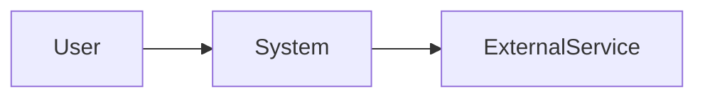

# Writing Solid `architecture.md` Files

This guide synthesizes current software architecture documentation practices from established frameworks such as C4, arc42, Views and Beyond, ISO/IEC/IEEE 42010, ADR guidance, Diataxis, and representative GitHub architecture documents.

## Purpose

An `architecture.md` file should give contributors a durable mental model of the system. It is the map that helps a reader understand:

- what the system is responsible for
- where its boundaries are
- which major parts exist and why
- how those parts communicate
- where important data, control, and deployment flows cross boundaries
- what architectural decisions, trade-offs, risks, and quality requirements shape the codebase

It should not try to duplicate every source file, endpoint, function, or configuration option. Highly volatile implementation inventory belongs in generated reference docs, API docs, README sections, environment docs, or inline code comments.

## Audience

Write for recurring contributors first:

- new engineers onboarding to the codebase
- maintainers reviewing cross-cutting changes
- operators debugging production behavior
- security reviewers looking for trust boundaries
- product or technical stakeholders trying to understand major capabilities and constraints
- AI coding agents that need a concise project map before modifying code

Different readers need different views. A strong architecture document separates stable explanation from detailed reference and links out to specialized docs.

## Core Principles

1. Start with context, not file structure.
   Explain the problem the system solves, the system boundary, and external actors/services before describing internals.

2. Optimize for stable architecture.
   Prefer durable concepts, invariants, boundaries, and flows over line-by-line implementation detail. If a section will drift every sprint, move it to a reference document or generate it.

3. Use multiple views.
   One diagram or one narrative cannot cover a real system. Combine context, container/component, runtime, data, deployment, and cross-cutting views as needed.

4. Explain why, not only what.
   The file should capture important design rationale and link to ADRs for deeper decisions.

5. Make diagrams reviewable.
   Prefer Mermaid, PlantUML, Structurizr DSL, or another diagrams-as-code format stored in Git. Every diagram needs a short explanation of components, relationships, and caveats.

6. Keep the top-level document navigable.
   Use a table of contents for longer docs. Keep headings predictable. Link to deeper files instead of growing one giant page.

7. Document quality attributes explicitly.
   Architecture is shaped by security, reliability, performance, scalability, maintainability, observability, privacy, cost, and operability. State the important ones and how the design addresses them.

8. Name risks and technical debt.
   A mature architecture document is honest about known weak points, transitional areas, missing safeguards, and future work.

9. Keep architecture distinct from tutorials and runbooks.
   Following Diataxis: `architecture.md` is primarily explanation plus selected reference. Setup steps, task recipes, and operational procedures should live in README, development docs, deployment docs, or runbooks.

10. Define an update policy.
    State what changes require updating the file, who owns it, and where related docs live.

## Recommended Structure

Use this as a default template. Trim sections that do not apply, and split large sections into linked files when the document grows too long.

````markdown
# Architecture

## Document Status
- Owner:
- Last updated:
- Review cadence:
- Scope:
- Related docs:

## Executive Summary
One to three paragraphs explaining what the system is, what problem it solves, and the architectural style at a high level.

## Goals and Non-Goals
- Goals:
- Non-goals:

## Stakeholders and Concerns
| Stakeholder | Main concerns | Where addressed |
| --- | --- | --- |

## System Context
Describe users, external systems, trust boundaries, and high-level communication.



## Architectural Drivers
- Functional drivers:
- Quality drivers:
- Business or operational constraints:
- Regulatory/security constraints:

## Solution Strategy
Summarize the major architectural choices and patterns.

## Container / Major Component View
Describe deployable units, applications, services, databases, queues, workers, and major modules.

| Component | Responsibility | Owns | Depends on |
| --- | --- | --- | --- |

## Runtime Views / Key Flows
Document the most important scenarios as sequence diagrams or numbered flows.

Examples:
- authentication
- request handling
- asynchronous jobs
- approval workflows
- error recovery
- background processing

## Data Architecture
Describe core entities, ownership, persistence stores, replication, retention, migrations, and data privacy boundaries.

## API and Integration Boundaries
Summarize protocols, event contracts, external dependencies, and compatibility expectations. Link to detailed API reference instead of duplicating every endpoint.

## Deployment View
Describe environments, infrastructure, networking, secrets, scaling model, release path, and operational dependencies.

## Security and Trust Model
Describe authentication, authorization, secrets, token handling, external trust boundaries, sensitive data flows, audit logging, and threat-model links.

## Cross-Cutting Concepts
Capture rules that affect many modules:
- error handling
- validation
- logging and tracing
- configuration
- caching
- idempotency
- concurrency
- transactions
- testing strategy

## Architectural Decisions
Summarize the most important decisions and link to ADRs.

| ADR | Decision | Status | Impact |
| --- | --- | --- | --- |

## Quality Attribute Scenarios
Write measurable scenarios where possible.

| Attribute | Scenario | Mechanism |
| --- | --- | --- |
| Reliability | If dependency X fails, user-facing operation Y degrades by doing Z. | Timeout, retry, fallback |

## Risks and Technical Debt
| Risk / debt | Impact | Mitigation / owner |
| --- | --- | --- |

## Evolution Roadmap
Describe known transitional architecture, target architecture, and migration constraints.

## Repository Map
Keep this coarse. Explain where major responsibilities live; do not list every file.

## Glossary
Define domain and technical terms that readers must know.

## Update Policy
Update this document when:
- a system boundary changes
- a deployable unit or storage technology changes
- a cross-cutting architectural rule changes
- a major runtime flow changes
- a new ADR supersedes prior guidance
````

## What Good GitHub Examples Tend to Include

Across strong public repository examples, the better architecture documents commonly include:

- a short executive summary before detailed structure
- explicit system boundaries and external dependencies
- C4-style context/container/component diagrams
- key runtime/data flows for important scenarios
- a decision table or ADR index
- a related-documents map
- security, deployment, and operational notes
- current limitations, transitional areas, or technical debt
- an update policy or review cadence

Less effective examples tend to become one of these:

- a long file tree with prose around it
- a duplicated API reference
- a stale list of implementation details
- a diagram with no explanation
- a decision-free description of what currently exists
- a design proposal mixed with current-state architecture without labels

## Checklist

Use this checklist when writing or reviewing an `architecture.md` file.

- Does the opening explain the system in business and technical terms?
- Does the document identify the system boundary?
- Are external actors, services, and trust boundaries visible?
- Are major deployable units or containers shown?
- Are major internal components described by responsibility?
- Are the most important runtime flows documented?
- Are data ownership, stores, and sensitive data flows explained?
- Are deployment environments and infrastructure assumptions documented?
- Are security, privacy, auth, and secrets treated explicitly?
- Are cross-cutting conventions documented?
- Are important trade-offs and decisions linked to ADRs?
- Are quality attributes described as design drivers, not afterthoughts?
- Are risks, technical debt, and transitional states named?
- Is volatile reference material moved out or linked?
- Are diagrams stored as text/source where possible?
- Does the document say when it must be updated?
- Could a new contributor use it to predict where code should live?
- Could a reviewer use it to spot architectural drift in a PR?

## Style Guidelines

- Prefer active voice and concrete nouns.
- Use consistent terms for components and boundaries.
- Use tables for compact inventories.
- Use diagrams for relationships and flows.
- Put rationale near the design it explains.
- Label current-state and target-state architecture clearly.
- Link to source files only when the path is stable and useful.
- Avoid screenshots of diagrams unless the editable source is also stored.
- Avoid marketing language, vague claims, and unmeasured quality promises.
- Keep markdown simple and portable.

## Suggested Split for Larger Repositories

For a growing system, use `architecture.md` as the entry point and split specialized material:

```text
docs/
  architecture.md              # durable system map and key views
  adr/                         # decision records
  api.md                       # API reference or links to generated reference
  data-model.md                # entities, schema, retention, privacy
  deployment.md                # environments, release, infrastructure
  security-architecture.md     # trust boundaries, auth, threat model
  observability.md             # logs, metrics, traces, alerts
  runbooks/                    # operational procedures
```

## Source Notes

Useful references for the practices above:

- C4 model: https://c4model.com/
- C4 diagrams: https://c4model.com/diagrams
- arc42 template overview: https://arc42.org/overview
- ADR guidance: https://adr.github.io/
- Diataxis documentation framework: https://diataxis.fr/start-here/
- SEI Views and Beyond collection: https://www.sei.cmu.edu/library/views-and-beyond-collection/
- ISO/IEC/IEEE 42010 conceptual model: https://www.iso-architecture.org/42010/cm/
- Google developer documentation style guide: https://developers.google.com/style
- Google markdown style guide: https://google.github.io/styleguide/docguide/style.html
- Matklad on `ARCHITECTURE.md`: https://matklad.github.io/2021/02/06/ARCHITECTURE.md.html

Representative GitHub examples reviewed:

- GitHub Awesome Copilot architecture agent: https://github.com/github/awesome-copilot/blob/main/agents/arch.agent.md
- Microsoft IF PowerPoint Generator architecture: https://github.com/microsoft/IF-PowerPoint-Generator/blob/main/docs/ARCHITECTURE.md
- Hack23 European Parliament MCP Server architecture: https://github.com/Hack23/European-Parliament-MCP-Server/blob/main/ARCHITECTURE.md
- AWS sample multi-region job routing architecture: https://github.com/aws-samples/sample-multi-region-job-routing-on-eks/blob/main/docs/architecture.md
- VILA-Lab Dive into Claude Code architecture: https://github.com/VILA-Lab/Dive-into-Claude-Code/blob/main/docs/architecture.md
- Routa architecture: https://github.com/phodal/routa/blob/main/docs/ARCHITECTURE.md
