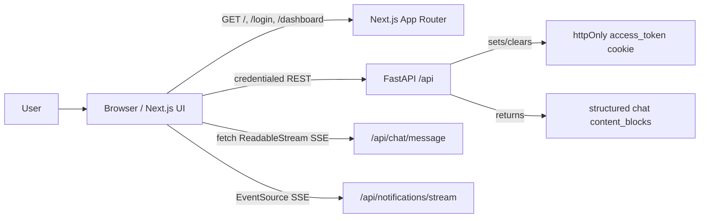
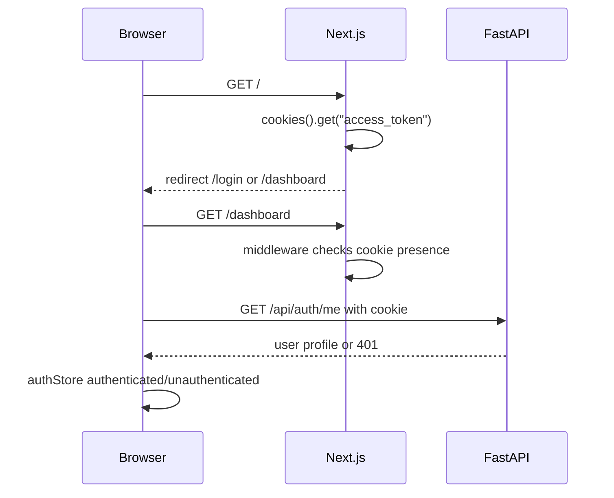
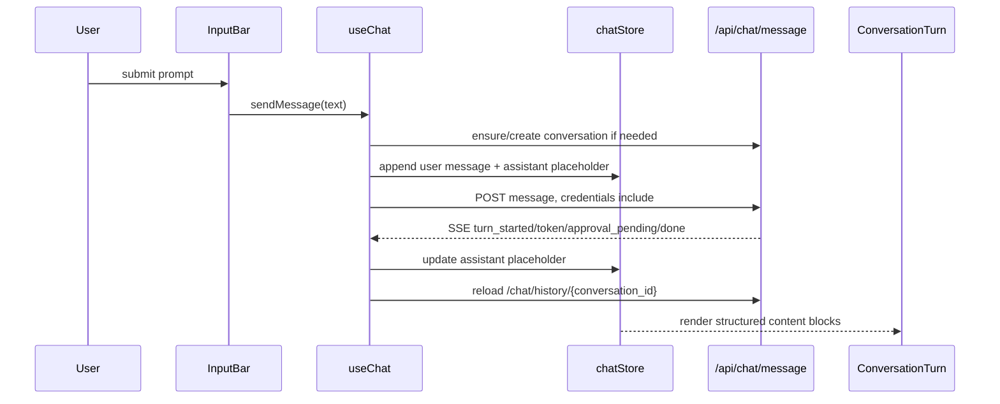
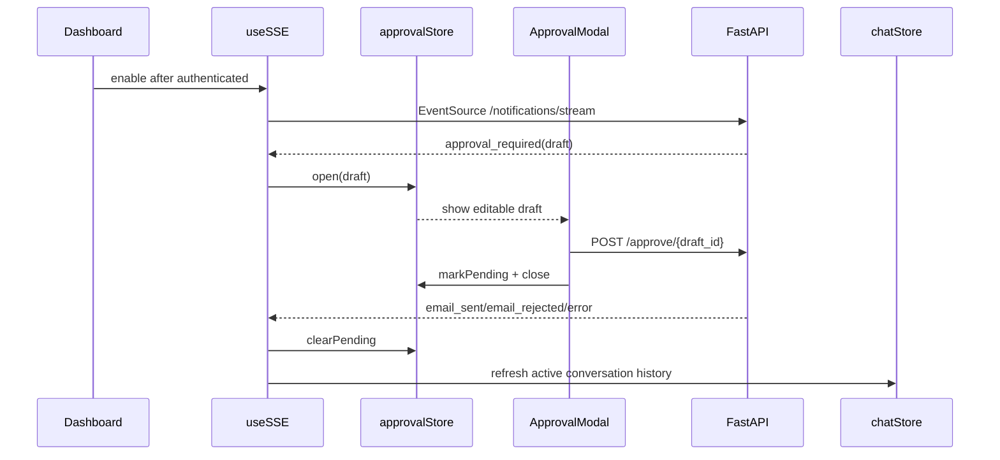

# Frontend Architecture

## Document Status

- **Scope:** Next.js frontend in `frontend/`, including routing, authentication UX, dashboard shell, chat rendering, approval modal, SSE handling, state stores, and backend contracts.
- **Audience:** frontend contributors, backend integrators, reviewers, designers, and coding agents.
- **Last reviewed:** 2026-06-21.

Update this file when frontend boundaries, backend contracts, state ownership, streaming behavior, auth assumptions, or dashboard composition changes.

## Executive Summary

The frontend is a Next.js 14 App Router application that renders the user-facing Gmail assistant dashboard. It is intentionally a client UI, not a privileged application server. Authentication, Gmail access, LLM orchestration, persistence, and email sending all live in the FastAPI backend.

The frontend's main architectural responsibilities are:

- route users based on cookie presence and backend session validation
- call backend REST endpoints with credentials
- consume two SSE paths: chat streaming and long-lived notifications
- keep UI state in small Zustand stores
- render backend-provided structured conversation blocks
- present approval/edit/reject controls for human-in-the-loop email sending

## Goals and Non-Goals

### Goals

- Keep the UI responsive during long-running agent work.
- Render rich assistant turns with summaries, research reports, email cards, status chips, and draft artifacts.
- Keep auth cookie handling browser-native and backend-owned.
- Make the approval modal globally reachable from notification events.
- Keep shared UI state explicit and small.
- Preserve the backend as the source of truth for conversations, drafts, notifications, and user session validation.

### Non-Goals

- The frontend does not read Gmail directly.
- The frontend does not store or inspect the JWT value beyond cookie-presence checks.
- The frontend does not send bearer tokens.
- The frontend does not own OAuth callback processing.
- The frontend does not persist conversation state locally beyond in-memory UI state.
- The frontend does not run backend logic through Next.js route handlers or server actions.

## System Context



The frontend talks only to the FastAPI API URL configured by `NEXT_PUBLIC_API_URL`. Cookie creation, deletion, and validation are backend responsibilities.

## Architectural Drivers

| Driver | Architectural response |
| --- | --- |
| Auth cookie is httpOnly | Frontend checks only cookie presence in middleware/server redirects; `/auth/me` validates the session. |
| Chat responses stream incrementally | `useChat` uses raw `fetch` and `ReadableStream` parsing instead of Axios. |
| Notifications are long-lived | `useSSE` uses browser `EventSource` with credentials and reconnect backoff. |
| Approval can arrive outside the active chat request | `ApprovalModal` is mounted globally in the dashboard layout and opened from notification state. |
| Assistant messages are structured | `ConversationTurn` renders a typed `ChatContentBlock` union rather than parsing arbitrary UI state. |
| Shared state is simple and local | Zustand stores own auth, chat, approval, and toast state. |

## Solution Strategy

The frontend uses a thin-client architecture:

- **Server components and middleware** perform cookie-presence redirects.
- **Client hooks** validate the session, call APIs, stream chat events, and subscribe to notifications.
- **Zustand stores** hold dashboard state.
- **Components** render state and dispatch user actions.
- **Type definitions** encode the backend/frontend contract for conversations, drafts, SSE events, and content blocks.

The backend remains authoritative. The frontend optimistically renders streaming placeholders but reloads conversation history from the backend after completion, approval-pending events, and notification events.

## Major Components

| Component | Responsibility | Key files |
| --- | --- | --- |
| App Router shell | Root layout, redirects, login page, dashboard shell, error boundaries. | `app/` |
| Route middleware | Cookie-presence guard for `/dashboard` and `/login`. | `middleware.ts` |
| API client | Axios instance, credential handling, 401 redirect, error normalization. | `lib/api.ts` |
| Auth hook/store | Session hydration via `/auth/me`, logout, user/status state. | `hooks/useAuth.ts`, `stores/authStore.ts` |
| Chat hook/store | Conversations, active messages, streaming request parsing, history reloads. | `hooks/useChat.ts`, `stores/chatStore.ts` |
| Notification hook | Long-lived EventSource subscription and approval/send event handling. | `hooks/useSSE.ts` |
| Approval state/modal | Editable draft review, approve/edit/reject submissions, pending guard. | `stores/approvalStore.ts`, `components/approval/ApprovalModal.tsx` |
| Chat rendering | Assistant/user turn layout and structured block rendering. | `components/chat/ConversationTurn.tsx`, `ChatWindow.tsx` |
| UI primitives | shadcn/Radix-derived primitives and custom toast rendering. | `components/ui/`, `hooks/use-toast.ts` |
| Type contract | Shared frontend representation of backend responses and SSE events. | `types/index.ts` |

## Runtime Views

### Route and Session Flow



Middleware and the home page do not validate the token. They only route based on whether the cookie exists. Real validation happens through `useAuth()` calling `/auth/me`.

### Chat Streaming Flow



Axios is not used for the streaming chat request because browser Axios cannot stream incremental SSE tokens in the required way. `useChat` manually parses `data:` events from the `ReadableStream`.

### Notification and Approval Flow



`approvalStore.pendingDraftIds` prevents stale SSE events from reopening a draft while an approval/reject request is in flight.

## State Architecture

| Store | State owned | Notes |
| --- | --- | --- |
| `authStore` | `user`, auth `status`. | Hydrated by `/auth/me`; reset on logout or failed auth. |
| `chatStore` | conversations, active conversation ID, messages, streaming flag. | Backend remains source of truth; history reloads replace message state. |
| `approvalStore` | modal open state, editable draft, original draft, feedback, pending draft IDs. | Prevents duplicate modal opens for in-flight drafts. |
| `useToastStore` | transient toast notifications. | Custom toast implementation used throughout hooks/components. |

State is intentionally in-memory. Reloading the browser rehydrates from backend conversation and auth endpoints.

## Data and UI Contract

The backend returns assistant messages as a `ChatMessage` with optional `content_blocks`. The frontend supports these block types:

| Block type | Rendered by | Purpose |
| --- | --- | --- |
| `markdown` | `MarkdownResponse` | Main assistant prose. |
| `status` | `StatusPill` | Waiting, success, warning, or error state. |
| `tool_action` | `ActionPill` | Completed/running tool activity labels. |
| `email_list` | `EmailCard` list | Gmail read/search results. |
| `summary` | `SummaryCard` | Inbox or thread summaries. |
| `research_report` | `ResearchCard` | Tavily/web research notes. |
| `draft_email` | `DraftEmailCard` | Inline draft artifact and approval/send state. |
| `system_notice` | `StatusPill` | Generic informational notices. |

If a backend message lacks blocks, `useChat` falls back to a single `markdown` block.

## API and Integration Boundaries

### Backend Base URL

`NEXT_PUBLIC_API_URL` should point to the backend API prefix, for example:

```text
http://localhost:8000/api
```

The fallback is duplicated in:

- `lib/api.ts`
- `hooks/useChat.ts`
- `hooks/useSSE.ts`

Keep those in sync if the default changes.

### API Access Patterns

| Need | Mechanism | Why |
| --- | --- | --- |
| Standard REST | Shared Axios `api` instance | JSON requests, credentials, error normalization, 401 redirect. |
| Chat streaming | Raw `fetch` + `ReadableStream` | Required for incremental SSE parsing. |
| Long-lived notifications | Browser `EventSource` | Native SSE connection and reconnect behavior. |

All API paths send cookies through `withCredentials: true` or `credentials: "include"`.

## Routing and Component Boundaries

### Server-Side / Edge Boundaries

- `app/page.tsx` reads cookie presence and redirects to `/login` or `/dashboard`.
- `middleware.ts` protects `/dashboard/:path*` and redirects `/login` to `/dashboard` when a cookie exists.
- `app/layout.tsx`, `app/login/page.tsx`, and `app/dashboard/layout.tsx` are server components.

### Client Boundaries

Interactive modules are marked `"use client"`:

- `app/dashboard/page.tsx`
- `app/providers.tsx`
- chat and approval components
- hooks
- stores
- UI primitives that need browser behavior

The active dashboard composition is:

```text
dashboard/layout.tsx
  ApprovalModal                # global, opened by notification state
  dashboard/page.tsx
    ConversationSidebar        # conversations, user card, logout
    ChatWindow                 # empty state + conversation turns
    InputBar                   # prompt submission
```

## Deployment View

The frontend is a Next.js 14 application using npm:

- Development: `npm run dev`.
- Production build: `npm run build`.
- Runtime config: `NEXT_PUBLIC_API_URL`, `NEXT_PUBLIC_APP_NAME`.
- `next.config.js` is minimal and does not use `output: "export"`.

Because the app depends on server components, middleware, cookies, and runtime redirects, it should be deployed as a Next.js app server, not as a static export.

The frontend and backend must be deployed with compatible cookie/CORS settings:

- Backend `FRONTEND_URL` must match the browser origin.
- Backend CORS must allow credentials.
- Cookie `secure` behavior depends on backend `APP_ENV`.

## Security and Trust Model

- The backend sets and clears the `access_token` cookie.
- The frontend checks cookie presence only for routing convenience.
- The frontend validates sessions by calling `/auth/me`.
- The frontend never reads Gmail tokens.
- The frontend never sends Authorization bearer headers.
- All state mutations that affect email sending go through `/api/approve/{draft_id}`.
- Draft content is visible in the browser and should be treated as sensitive UI data.

## Cross-Cutting Concepts

### Error Handling

`lib/api.ts` normalizes FastAPI error shapes into readable messages. Axios `401` responses redirect to `/login?next=...`, guarded to avoid loops. User-facing failures generally show toasts.

### Streaming Consistency

The frontend expects SSE payloads as JSON in `data:` lines. `useChat` handles `turn_started`, `token`, `approval_pending`, `turn_completed`, `done`, and `error`. `useSSE` handles `approval_required`, `email_sent`, `email_rejected`, and `error`.

### Rendering Strategy

The backend produces semantic blocks; the frontend renders them. This keeps UI formatting logic out of agent prompts and avoids frontend parsing of raw tool transcripts where possible.

### Markdown Strategy

`MarkdownResponse` is a small custom renderer for headings, blockquotes, ordered/unordered lists, bold, italic, and inline code. It is not a full Markdown engine.

## Architectural Decisions

| Decision | Status | Rationale / impact |
| --- | --- | --- |
| Use Next.js App Router with client-heavy dashboard | Accepted | Server routes handle redirects; browser components handle interactive chat/approval state. |
| Keep auth cookie backend-owned | Accepted | Preserves httpOnly token handling and keeps validation on FastAPI. |
| Use Zustand for dashboard state | Accepted | Small stores fit the dashboard's limited shared state needs without a larger data framework. |
| Use raw `fetch` for chat SSE | Accepted | Required for incremental stream parsing. |
| Use `EventSource` for notifications | Accepted | Native browser fit for long-lived server-pushed events. |
| Mount approval modal globally | Accepted | Approval requests can arrive outside a single chat component lifecycle. |
| Render backend-defined content blocks | Accepted | Keeps assistant turn semantics consistent across live and persisted history. |

Create ADRs under `docs/adr/` if these decisions change or if a new cross-cutting frontend decision is introduced.

## Quality Attribute Scenarios

| Attribute | Scenario | Mechanism |
| --- | --- | --- |
| Security | A user opens `/dashboard` with a stale cookie. | `useAuth` calls `/auth/me`; failed validation resets auth state and API 401 redirects to login. |
| Responsiveness | Agent work takes time. | Optimistic assistant placeholder plus streamed token/status updates. |
| Recoverability | The chat stream finishes or is interrupted for approval. | Frontend reloads canonical history from `/chat/history/{conversation_id}`. |
| Consistency | Approval notification arrives while modal request is in flight. | `pendingDraftIds` suppresses duplicate modal opens. |
| Maintainability | Backend adds a new structured artifact. | Add a `ChatContentBlock` type and renderer case in one place. |
| Operability | Notification stream drops. | `useSSE` reconnects with capped exponential backoff. |

## Risks and Technical Debt

| Risk / debt | Impact | Mitigation |
| --- | --- | --- |
| No frontend test setup | UI flows, SSE parsing, and approval state can regress silently. | Add Vitest/Testing Library or Playwright coverage before larger UI changes. |
| API base fallback is duplicated | Defaults can drift across Axios, chat fetch, and EventSource. | Centralize API URL helper. |
| Custom Markdown renderer is limited | Unexpected model output may render poorly. | Adopt a vetted Markdown renderer if richer output is needed. |
| Cookie-presence routing can show dashboard briefly for invalid sessions | Middleware does not validate JWT. | Keep `/auth/me` hydration early; consider server validation only if backend session introspection is exposed safely. |
| No generated API client | Backend/frontend contract drift is possible. | Add OpenAPI-generated types or contract tests. |
| Draft content lives in browser state | Sensitive content can remain visible in memory while the app is open. | Clear stores on logout and avoid persistent client storage. |

## Repository Map

```text
frontend/
  app/
    layout.tsx              # root document and providers
    page.tsx                # cookie-presence redirect
    login/page.tsx          # Google login entry UI
    dashboard/
      layout.tsx            # dashboard shell + global ApprovalModal
      page.tsx              # authenticated dashboard composition
  components/
    approval/               # approval modal
    chat/                   # sidebar, chat window, turns, cards, input, markdown
    ui/                     # shadcn/Radix primitives
  hooks/
    useAuth.ts              # session hydration/logout
    useChat.ts              # conversations + chat stream
    useSSE.ts               # notification stream
    use-toast.ts            # toast state
  stores/
    authStore.ts            # user/session state
    chatStore.ts            # conversations/messages/streaming state
    approvalStore.ts        # draft approval modal state
  lib/
    api.ts                  # Axios client and error handling
    utils.ts                # cn helper
  types/
    index.ts                # backend/frontend contract types
```

## Verification

Use the smallest relevant check after frontend changes:

- Lint: `npm run lint`
- Build/type check: `npm run build`
- Lightweight type check: `npx tsc --noEmit`

Known caveat: no test script or test framework is currently configured.

## Glossary

- **Content block:** Typed backend response object rendered by `ConversationTurn`.
- **Approval modal:** Global dialog for approving, editing, or rejecting pending email drafts.
- **Chat SSE:** Request-scoped stream returned by `/api/chat/message`.
- **Notification SSE:** Long-lived EventSource stream returned by `/api/notifications/stream`.
- **Cookie presence:** Frontend routing heuristic; not proof of a valid session.
- **Canonical history:** Backend-reconstructed conversation history from LangGraph checkpoints and draft rows.

## Update Policy

Update this document when:

- auth routing or session validation behavior changes
- frontend/backend API or SSE event contracts change
- a new content block type is added
- shared state ownership moves between stores/hooks/components
- dashboard layout or approval flow changes materially
- deployment assumptions or required environment variables change
- a major UI risk is resolved or introduced
